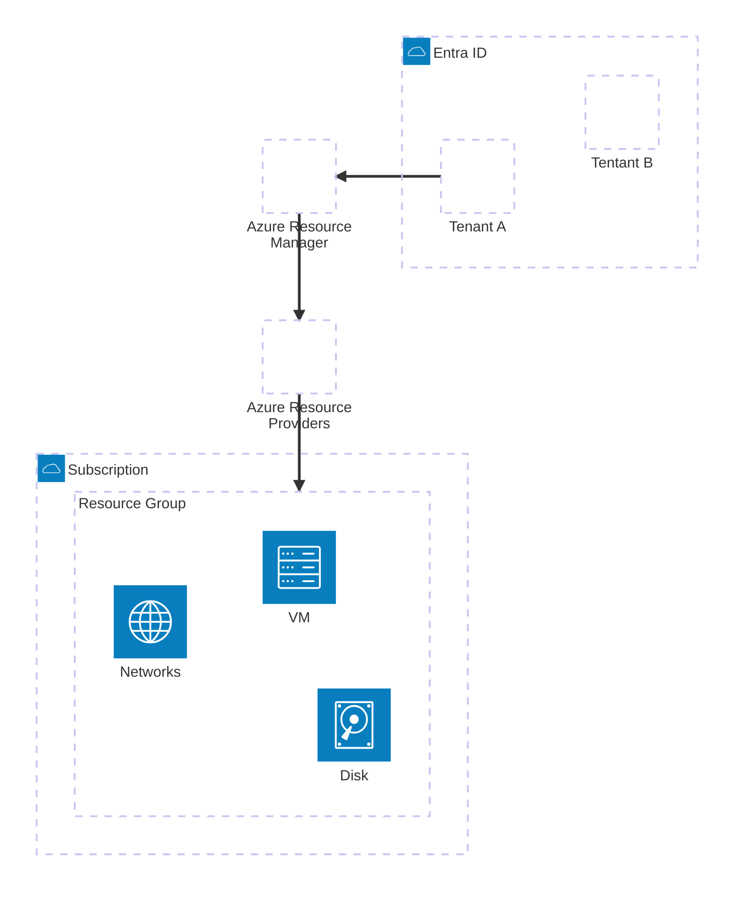

---
tags:
  - azure
---

# Qué son os resources?
Os resources son a unidade máis pequena dentro da nube de Azure e son cousas como máquinas virtuales, cuentas de almacenamiento, redes virtuales e calquer outro recurso que poidamos utilizar para cargas de traballo. Os resources son agrupados dentro de **resource groups** e só poden pertenecer a un RG, pero podemos movelos entre resource groups. Os recursos non teñen porque estar na mesma región que os resource groups. 
# Qué son os resource groups?
Os **Resource Groups** de Azure funcionan como contedores lóxicos, permitindo agrupar recursos relacionados, o cal simplifica a súa organización e administración. Cada Resource Group está intrinsecamente asociado a unha **subscrición de Azure** É importante recalcar que os Resource Groups non generan costos e non están vinculados a unha región específica, Esto significa que poden ter recursos desplegados en diversas regións. A maiores, presentan tamén unha ventaja en que se eliminamos un RG tamén se eliminan os recursos que lle pertenecen.
# Qué son as suscripcións?
As suscripcións son agrupacións lógicas que agrupan conxuntamente resource groups e resources. É o que utilizamos para determinar os nosos costos na nube de Azure. As suscripcións están dentro da nosa organización. Podemos utilizalas para separar os gastos por departamento, entorno,método de pago, etc. Unha suscripción só pode ter un tenant asignado, pero un tenant pode ter varias suscripcións.
# Como administrar Azure
Podemos interacturar con Azure para administralo através das seguintes maneiras:
* **Azure portal**: Azure Portal é a interfaz gráfica que se pode acceder mediante a web ([portal.azure.com](https://portal.azure.com/)). Desde esta web podemos crear recursos de maneira gráfica ou tamén os podemos crear de maneira programática mediante a Cloud Shell que nos permite interactuar con Azure mediante [[02 - Azure CLI e Azure PowerShell|Azure CLI e Azure PowerShell]].
* [[02 - Azure CLI e Azure PowerShell|Azure CLI e Azure PowerShell]]: Podemos instalar Azure CLI e Azure Powershell na nosa máquina e interactuar con Azure dende o noso propio equipo.

