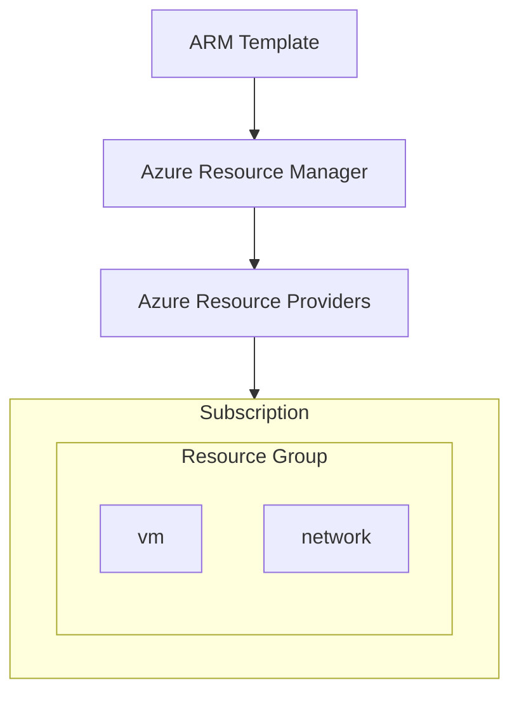

---
tags:
  - azure
---

As Azure Resource Manager Templates son archivos en formato JSON que definen a infraestructura e a configuración de un proxecto de Azure. 

Grazas a esto podemos codificar a nosa infraestructura como IaC, o que nos permite desplegar entornos de maneira rápida e que os nosos despliegues sexan repetitivos.

Unha ARM template ten a seguinte estructura
```json
{
  "$schema": "https://schema.management.azure.com/schemas/2019-04-01/deploymentTemplate.json#",
  "contentVersion": "1.0.0.0",
  "parameters": {},
  "functions": [],
  "variables": {},
  "resources": [],
  "outputs": {}
}
```

A continuación vamos a explicar a estructura da ARM template:
- **Schema:** Define o tipo de propiedades que están disponibles para usar nunha template.
- **contentVersion:** É utilizado para establecer a versión da template manualmente.
- **parameters:** Pasar parámetros á plantilla á hora de ejecución.
- **functions:** Danos a posibilidade de gardar lógica compleja que é reutilizada na plantilla.
- **variables:** Valores generados dinámicamente que se almacenan para ser usados na plantilla. Tamén poden ser un valor estático. 
- **resources:** Objetos JSON que describen que recursos van ser desplegados.
- **outputs (opcional):** Despois de que finalice un despliegue, podemos utilizar os valores de salida en outra aplicación ou script.

O propio portal de Azure ten unha funcionalidade (custom ) que nos permite crear as nosas propias templates de unha maneira gráfica para que sea máis sencillo poder crealas.
# Exportar un Resource Group a ARM Template
Mediante o seguinte comando de [[02 - Azure CLI e Azure PowerShell#^75a6fc|Azure CLI]] podemos exportar un [[Apuntes/Servicios/Cloud/Azure/01 - Administración de Azure/01 - Introducción#Qué son os resource groups?|resource group]] a un fichero `.json` de ARM Template.
```bash
az group export --name "your_resource_group_name" > [OUTPUT.json]
```

