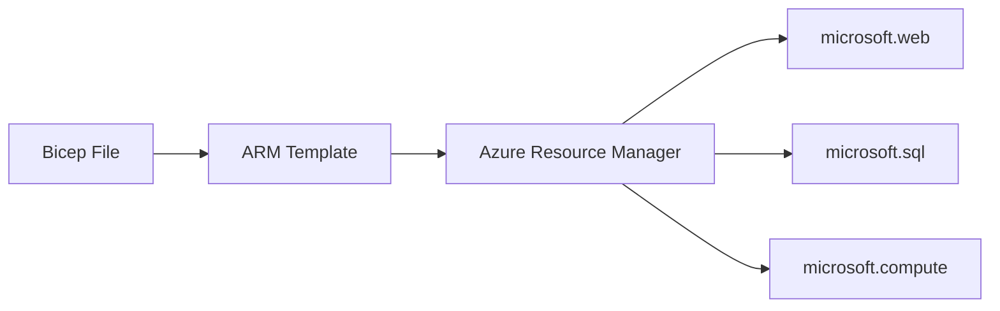

---
tags:
  - azure
---
Os Azure Biceps son unha forma alternativa ás [[03 - Azure Resource Manager (ARM) Templates|ARM Templates]] de implementar e desplegar recursos en Azure. Teñen un lenguaje máis simple e limpio que as ARM Templates. 
# Comparativa entre ARM Template e Azure Biceps
Aquí podemos ver unha comparativa entre a sintaxis de unha ARM Template e Azure Bicep para desplegar un Storage Account.

**ARM Template**
```json
{
  "$schema": "https://schema.management.azure.com/schemas/2019-04-01/deploymentTemplate.json#",
  "contentVersion": "1.0.0.0",
  "parameters": {},
  "functions": [],
  "variables": {},
  "resources": [
    {
      "name": "storageaccount1",
      "type": "Microsoft.Storage/storageAccounts",
      "apiVersion": "2021-04-01",
      "location": "eastus",
      "kind": "StorageV2",
      "sku": {
        "name": "Premium_LRS",
        "tier": "Premium"
      }
    }
  ],
  "outputs": {}
}
```

**Azure Bicep**
```bicep
resource sa 'Microsoft.Storage/storageAccounts@2021-06-01' = {
  name: 'storageaccount1'
  location: 'eastus'
  sku: {
    name: 'Standard_LRS'
  }
  kind: 'StorageV2'
}
```

A forma na que funciona Azure Bicep é que é unha capa de abstracción sobre as ARM Templates como se pode ver no seguinte esquema.


Polo tanto cando se executa un fichero bicep o que fai é que se traduce á un ARM Template que se comunica co Azure Resource Manager. 
# Migrar de ARM Template a Azure Bicep
Podemos "decompilar" o código JSON de unha ARM Template a Azure Bicep utilizando o seguinte comando
```bash
az bicep decompile --file [ARM_TEMPLATE_NAME]
```

Este comando crea un fichero, no directorio que estamos, co mismo nombre que o fichero JSON pero terminado en `*.bicep` en lugar de `*.json`. Se o fichero **bicep** xa existe, hai que utilizar a opción `--force` para sobreescribilo.

> [!TIP]
> É importante revisar o fichero resultante de esta exportación para asegurarse de que a conversión se realizou con éxito xa que pode haber casos en que teñamos resultados inesperados.
# Convertir Azure Bicep a ARM Template
Podemos utilizar o seguinte comando de [[02 - Azure CLI e Azure PowerShell#^75a6fc|Azure CLI]] para convertir un fichero `.bicep` a un fichero `.json` de ARM Template
```bash
az bicep build --file deploy.bicep --outfile test.json
```
