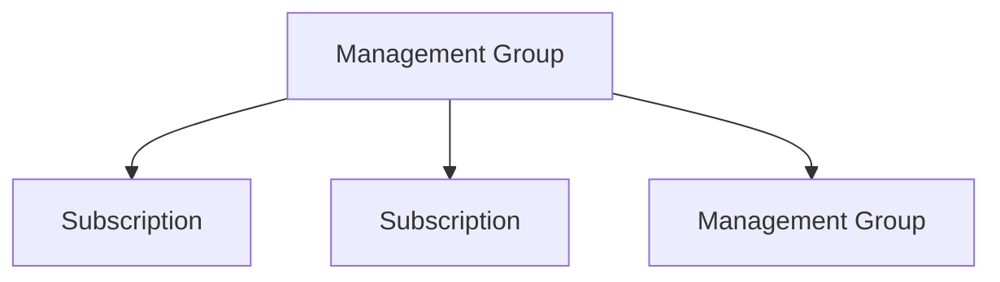

---
tags:
  - azure
---
Para administrar recursos en Azure podemos facelo mediante os seguintes elementos:
- Tags
- Bloqueandos
- Movelos
# Tags
Os _tags_ son pares clave-valor que se utilizan para organizar recursos. O que significa que temos un nombre e un valor. As etiquetas podense **asignar** a case **calquer cousa** en Azure. Podense agregar a [[Apuntes/Servicios/Cloud/Azure/01 - Administración de Azure/01 - Introducción#Qué son as suscripcións?|suscripcións]], [[Apuntes/Servicios/Cloud/Azure/01 - Administración de Azure/01 - Introducción#Qué son os resource groups?|resource groups]], e [[Apuntes/Servicios/Cloud/Azure/01 - Administración de Azure/01 - Introducción#Qué son os resources?|recursos]]. 

Son útiles porque nos permiten identificar un elemento dentro de Azure de maneira sencilla. 

Ademáis, os tags podense modificar de maneira rápida e podense aplicar varias a un tipo de recurso. Esto é especialmente útil, por exemplo, para poder diferenciar quen é a persoa responsable de un recurso, ou aplicar reglas de automatización cando queremos que os recursos que teñan a etiqueta _'beta'_ se apaguen os fins de semana para aforrar costes. 

É importante recalcar que as etiquetas non se heredan, polo que se etiquetamos unha suscripción esta etiqueta non será heredada polos grupos de recursos. Así tamén ocurre cos resource groups e os recursos. 
# Bloquear recursos
En Azure, podemos bloquear suscripcións, resource groups e recursos o que nos sirve como protección contra eliminacions accidentais. Podemos bloquear das seguintes maneiras:
- Contra eliminación: de esta maneira o recurso ainda se pode modificar pero non se podería eliminar.
- Read-only: de esta maneira o recursos non se pode nin eliminar nin modificar.
# Mover recursos
Mediante o administrador de recursos de Azure podemos mover cousas a diferentes grupos de recursos, suscripcións e incluso mover entre regións.  

É importante destacar que aunque cando vaiamos a mover recursos estos van a estar bloqueados, vanse a poder seguir usando. Despois de acabar de moverse o _resource ID_ vai a ser cambiado por outro. Por eso se utilizamos o _resource ID_ en scripts debe ser actualizado nestos despois de movelo.
# Azure Policy
As _Azure Policy_ son usadas para monitorizar e forzar reglas en todos os recursos de Azure. Algunhas destas poden ser:
- Convención de nombres
- Tags
- Tamaño de recursos
- Configuración dos recursos
- Retención de datos

O primeiro paso para aplicar _Azure Policies_ é crear unha _Policy definition_. Podemos crear unha nos mesmos ou utilizar unha das que xa están creadas por defecto. Unha vez feito esto, temos que asignar a política a unha suscripción, un grupo de administración, grupo de recursos ou incluso a un recurso individual. Tamén se pode crear unha iniciativa que é un grupo de definición de politicas que se relacionan xuntas.

Existe tamén unha condición de comprobación que comproba cada 24h as asignacións de maneira automática. Finalmente, executaríase unha acción que indicaría que facer en caso de que as condicións non cumplan coas definicións da política.
# Management Groups
Os _management groups_ ou _grupos de administración_ é unha forma de organizar e administrar suscripcións lógicamente agrupandoas en un _management group_.

O que nos daría o seguinte diagrama de xerarquía:

Esto permitenos organizar os nosos recuros con relacións padre-hijo, con un máximo de seis niveles de herencia. Esta organización tamén nos permite aplicar [[#Azure Policy|Azure Policies]] e Azure role-based access control (RBAC). Por exemplo, podemos aplicar unha _Azure Policy_ a un _management group_ e este aplicarao aos demáis gurpos de administración e suscripcións debaixo de eles.